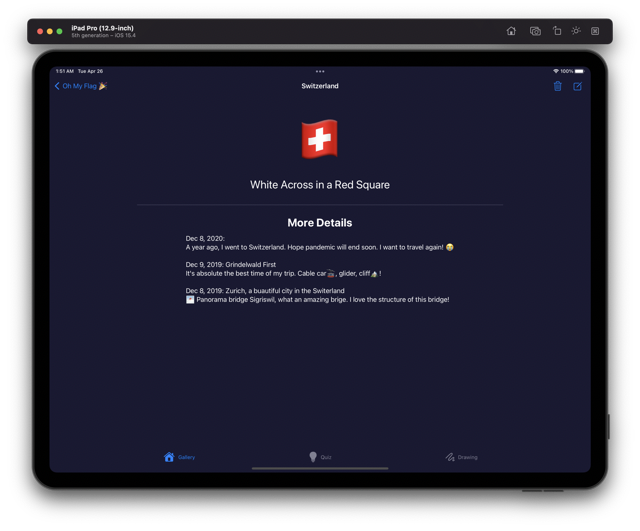

<!--
 * @Author: Frank Chu
 * @Date: 2022-04-22 21:39:00
 * @LastEditors: Frank Chu
 * @LastEditTime: 2023-03-12 22:00:23
 * @FilePath: /OhMyFlag-WWDC22/readme.md
 * @Description: 
 * 
 * Copyright (c) 2023 by ${git_name}, All Rights Reserved. 
-->
# Oh My Flag

[Privacy Policy](/privacy-policy.md)

The App Oh My Flag helps students get familiar with flags. It is both educating and entertaining with the design of multi-module and interactive tasks.

## Screenshot

|  |  |        |
| :----------------------------------------------: | :------------------------------------------: | :----------------------------------------------: |
|                   Gallery Page                   |              Add New Flag Sheet              |                 Oh My Quiz Game                  |
|    |    |  |
|                   Detail Page                    |                  Edit Sheet                  |                   Drawing Page                   |

Detailed walk-through video: [Twitter Link](https://twitter.com/cyongfrank/status/1518663840463872000)

## Installation

1. Download the [Swift Playgrounds](https://apps.apple.com/us/app/swift-playgrounds/id908519492) on your iPad.
2. Download the [Oh My Flag.swiftpm](https://github.com/yongfrank/OhMyFlag-WWDC22/raw/main/OhMyFlag.swiftpm.zip) file to your Mac or PC.
3. Open the "Oh My Flag.swiftpm" file in Swift Playgrounds on iPad with AirDrop(Recommended).

## DocC Step-by-Step Tutorial

To have a better experience, please follow the steps in the picture to get the step-by-step tutorial. 

## What are the features and technologies inside the App?

* SwiftUI
* CoreData
* PencilKit
* DocC

According to learning theory, individuals will learn better if they use more than one sense. Hence, Oh My Flag tries to employ different ways to help students learn "both familiar and strange" flags on the emoji keyboard. There are three tabs: taking notes, playing quizzes, and drawing pictures, which deepen the understanding of flags and the new cultures in every corner of the world. They can add flags manually and write some personal experiences about this flag. Besides, it is easy to learn a new flag with the "Random Add, Quiz, Drawing" parts in the App. The flags can be reviewed anytime - before watching a foreign film, getting to know a country after the history class, or on the anniversary of moving to a new place.

Easy-to-use designs are ones that users find so familiar and intuitive. Therefore, SwiftUI, SF Symbols 3, and Emoji are adopted to make better App design. All image assets in Oh My Flag are based on these two unprecedented symbol systems. There are better user interfaces and consistent user experiences in Oh My Flag, such as unified image resources, flags in the stack, flag animation, etc. All the beloved flags and notes will be stored in the device safely with the help of Code-based CoreData. Finally, as a good partner for iPad, Apple Pencil and PencilKit provide a comfortable painting experience and stimulate inspiration when users are creating. 

Except for the built-in technologies, the DocC walkthrough tutorial outside the App can improve the project experience too. The Learning Center and step-by-step tutorial dedicated to the Playgrounds App are amusing and attractive. It's easier for users to understand the code, details in the App, and usage methods with these sections. 

## Why did I make this App?

> Every child is born full of creativity. Nurturing it is one of the most important things educators do. Creativity makes your students better communicators and problem solvers. It prepares them to thrive in today’s world — and to shape tomorrow’s.
>
> Apple is constantly creating resources to help educators do just that. Not only powerful products, but also tools, inspiration, and curricula to create magical learning experiences and make every moment of screen time worth it.
>
> [From: Apple K-12 Education](https://www.apple.com/education/k12/)

Last year I joined iOS Club – a club for students interested in Apple. I got in touch with a program called Apple Teacher here. At present, Apple Teacher is held at every Apple authorized reseller to spread equity in education. Although Apple Store is a cool place for people to study and share knowledge about Apple products, there aren't Apple Stores everywhere. Therefore, the Apple Teacher program can provide those people with knowledge from Apple.

In Dec. 2021, Swift Playgrounds 4 launched. This new programming language is easy to write and understand. Kids created their apps within only three days in the Apple Teacher program. They are more creative than I can imagine in such a short period.

My inspiration for the Oh My Flag App also comes from Apple Teacher Program. Before introducing the programming language, we had discussed different flags and languages in class. When I found these kids are curious about unfamiliar flags, an idea appeared – why not make an App to help them memorize the flags they like? The prototype of this App began to grow in my mind.

## The App would not have been possible without the help of

* [@twostraws](https://twitter.com/twostraws) - Paul Hudson My Swift Teacher
* [@leonardolu](https://github.com/leonardolu)
* People on the [StackOverflow](https://stackoverflow.com) Community
* And anyone who helped me

